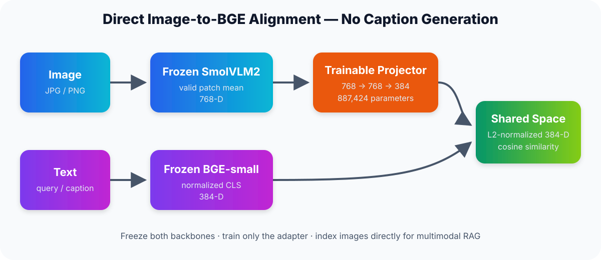

# SmolBGE · Image Embeddings for RAG

[中文](README_zh-CN.md) · [GitHub](https://github.com/3513542967-creator/smolbge-image-embedding) · [Weights](https://huggingface.co/yifanouyang/smolbge-image-embedding) · [Model card](MODEL_CARD.md)

Encode images and English text into a shared **384-dimensional** space for retrieval. A **3.4 MiB adapter** aligns a frozen SmolVLM2 vision encoder with BGE-small. Images are embedded directly, with no caption generation.



## Results

Custom COCO val2017 split: **4,000 train / 500 validation / 500 test images**, five captions per image, seed 42. Image IDs are disjoint; validation selects the adapter.

| Method | Image → text R@1 | Text → image R@1 |
|:--|--:|--:|
| Linear baseline | 45.40% | 59.84% |
| **Released adapter** | **68.00%** | **60.76%** |

Image → text searches 2,500 captions; any paired caption in first place is a hit. Text → image searches 500 images. Image → text improves **22.6 percentage points** over the linear baseline (paired bootstrap 95% CI: +18.0 to +27.2).

[All five baselines and metrics](results/evaluation.json) · [Exact split IDs](data/splits/coco5k_seed42.json)

## Quick start

Python 3.12 recommended. Install into a virtual environment:

```bash
python -m venv .venv
source .venv/bin/activate  # Windows PowerShell: .venv\Scripts\Activate.ps1
python -m pip install "git+https://github.com/3513542967-creator/smolbge-image-embedding.git"
smolbge --images ./photos --query "a dog playing outside" --top-k 5
```

The first run downloads the adapter and both base checkpoints from Hugging Face; allow network access and disk space for the base models, not just the adapter. No COCO download or training is needed for inference. CUDA, Apple MPS, or CPU is selected automatically; use `--device cpu` to override. The command encodes the folder each run and returns ranked file paths and cosine scores.

```python
from smolbge_image_embedding import SmolBGEEmbedder

model = SmolBGEEmbedder.from_pretrained()  # downloads published adapter
images = model.encode_images(["photo.jpg"])  # (1, 384)
query = model.encode_text("a dog playing outside")  # (384,)
scores = images @ query
print(scores)
```

Save the image vectors in your vector database for repeated queries. Local weights are also supported: `SmolBGEEmbedder.from_pretrained(".")` from a clone with Git LFS weights downloaded.

## Method & reproduction

- **Alignment:** masked patch pooling → 768→768→384 MLP; only **887,424 parameters** trained.
- **Objective:** bidirectional contrastive loss, caption-centroid distillation, and hard-negative margin.
- **Engineering:** cached backbone features, validation-based early stopping, reusable batch API, Hub weight loading and retrieval CLI.

[Reproduce training and evaluation](docs/REPRODUCE.md) · [Source](src/smolbge_image_embedding/modeling.py)

Evaluation covers English COCO-domain retrieval on a custom split, not the standard COCO benchmark or end-to-end RAG answer quality. Upstream pretraining exposure is possible; cross-domain and image-to-image retrieval quality are unverified.

Code and adapter: [Apache-2.0](LICENSE). Base models and COCO retain their [own terms](THIRD_PARTY.md).
