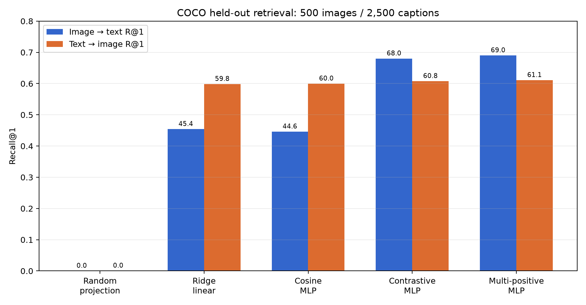

# SmolBGE 图像 Embedding

[英文主页](README.md) | [完整结果](results/evaluation.json) | [模型卡](MODEL_CARD.md)

这是一个面向多模态 RAG 的轻量图文 Embedding 模型：图片不先生成 caption，而是直接转换为 BGE 文本向量空间中的 384 维归一化向量。

> GitHub：`https://github.com/3513542967-creator/smolbge-image-embedding`  
> Hugging Face：`https://huggingface.co/yifanouyang/smolbge-image-embedding`

## 任务

支持三种基础检索：

- 文字搜图片；
- 图片搜文字；
- 图片搜相似图片。

图片侧使用 SmolVLM2-500M 的冻结视觉塔，对有效 patch token 做掩码平均，得到 768 维向量；再经过只有 887,424 个可训参数的 MLP，对齐到 BGE-small 的 384 维文本空间。


## 数据集

使用 COCO `val2017` 中的 5,000 张图，每张图保留 5 条人工 caption。

| 划分 | 图片 | Caption | 用途 |
|---|---:|---:|---|
| 训练 | 4,000 | 20,000 | 训练对齐头 |
| 验证 | 500 | 2,500 | 选择方法和检查点 |
| 测试 | 500 | 2,500 | 最终盲测 |

随机种子为 42，按图片 ID 隔离，同一图片的五条 caption 不会跨划分。精确 ID 在 [`data/splits/coco5k_seed42.json`](data/splits/coco5k_seed42.json)。项目不重新分发 COCO 原图。

## 测试方法

- **图→文**：500 张图分别检索 2,500 条 caption；对应的 5 条 caption 中任一条进入 Top-K 即成功。
- **文→图**：2,500 条 caption 分别检索 500 张图；原始图片进入 Top-K 即成功。
- 使用余弦相似度排序。
- 只用验证集选模型，测试集不参与选模。

## 结果

| 方法 | 图→文 R@1 | 图→文 R@5 | 文→图 R@1 | 文→图 R@5 |
|---|---:|---:|---:|---:|
| 随机投影 | 0.00% | 0.60% | 0.04% | 0.60% |
| Ridge 线性 | 45.40% | 78.20% | 59.84% | 86.64% |
| 余弦 MLP | 44.60% | 76.80% | 59.96% | 86.08% |
| **对比学习 MLP（发布版）** | **68.00%** | **90.60%** | **60.76%** | **88.16%** |
| 多正例 MLP | 69.00% | 90.00% | 61.08% | 87.44% |



多正例模型的测试 R@1 略高，但验证集选模分数更低，因此没有在看到测试结果后更换模型。

发布模型还达到：图→文 R@10 95.00%，文→图 R@10 95.12%。

## 快速使用

```bash
python -m pip install -e .
```

```python
from smolbge_image_embedding import SmolBGEEmbedder

model = SmolBGEEmbedder.from_pretrained(".")
image = model.encode_image("example.jpg")
text = model.encode_text("一只在户外玩的狗")
score = float(image @ text)
```

注意：当前训练和评测 caption 为英文，中文检索效果尚未做严格评估。

## 局限

- 目前只有 COCO 域内测试，还不能代表医疗、遥感、电商或文档截图。
- 基础模型可能在预训练中见过 COCO 或相似数据。
- 全局平均池化可能丢失小物体和空间位置信息。
- 生产系统建议配合 OCR、元数据过滤、局部区域向量和 VLM 重排。

GitHub 和 Hugging Face 发布步骤见 [`PUBLISHING.md`](PUBLISHING.md)。
